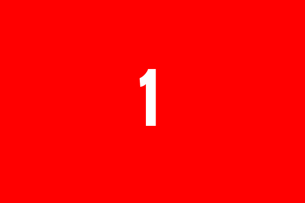
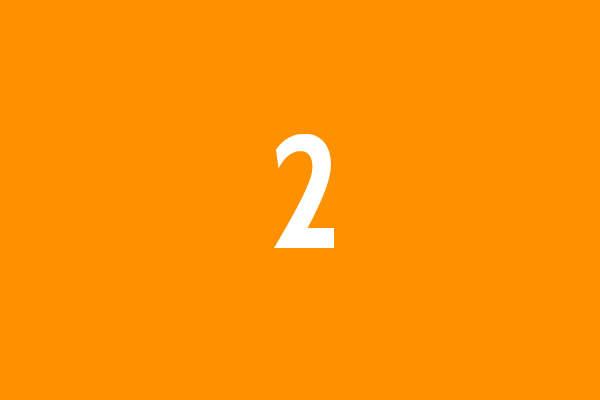
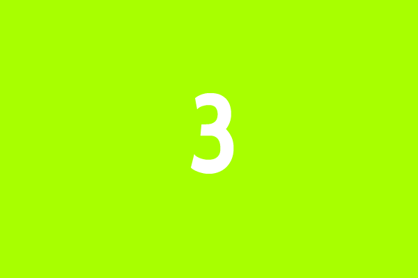
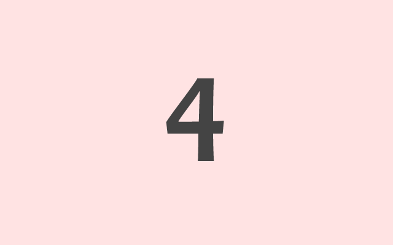

Adaptor, a jQuery 3D content slider
===

Adaptor is a light-weight content slider that aims to provide a simple
interface for developers to create cool 2D or 3D slide animation transitions.

Support
---

Currently, I've only added 3D support for webkit and Firefox, all other browsers
will fallback gracefully to a simple fade transition when using the 3D effects.

All 2D slide transitions have been tested in IE6+ and all other modern browsers.

Usage
---

Create a view port for the 3D perspective and within that add the HTML to create
a box containing slides of content.

```html
<div class="slider-viewport"><!-- works as a viewport for the 3D transitions -->
  <div id="content-box"><!-- the 3d box -->
    <figure><!-- slide -->
      
      <figcaption>This is slide one's description</figcaption>
    </figure>
    <figure>
      
      <figcaption>This is slide two's description</figcaption>
    </figure>
    <figure>
      
      <figcaption>This is slide three's description</figcaption>
    </figure>
    <figure class="slide">
      
      <figcaption>This is slide four's description</figcaption>
    </figure>
  </div>
</div>
```

Technically no CSS is required but if the outer box `div.slider-viewport` is
statically positioned the plugin will apply relative positioning to it so that
it can hold the absolutely positioned box. It should be noted that the viewport
and box should be the same width and height as the content slides so that the
rotation does not appear off center. It is also a good idea to constrain the
size of the viewport so that the slides don't spew down the page at load time.

```css
/* overfow will get set to visible on initialisation of the plugin */
.slider-viewport { width: 560px; height: 380px; overflow: hidden }
```

Include the `box-slider.jquery.js` (this one first) and the desired effect
scripts (these second) in your page and then on page load the usual jQuery
sugaryness applies...

```javascript
$('#content-box').boxSlider( /* options */ );
```

Options
---

* `speed (default: 800)` The time interval in milliseconds within which the
  slide animation will complete
* `autoScroll (default: false)` Set true to automatically transition through
  the slides
* `timeout (default: 5000)` The time interval between slide transitions. For use
  with autoscroll
* `pause (default: null)` A DOM element, jQuery object or selector for an element
  that when clicked will toggle the autoscoll state of the slider. When the slider
  is in a paused state the element will be applied a class name of paused
* `pauseOnHover (default: false)` Pause an auto-scrolling slider when the users
  mouse hovers over it. For use with autoscroll
* `next (default: null)` A DOM element, jQuery object or selector for an element
  that when clicked will advance the slider to the next slide
* `prev (default: null)` A DOM element, jQuery object or selector for an element
  that when clicked will advance the slider to the previous slide
* `effect (default: 'scrollVert3d')` The slide animation effect to use when
  scrolling through content slides


Effect options
---

### `srollVert3d,scrollHorz3d`
* `perspective (default: 1000)` The 3D perspective at which the content slides
  are placed from the view port during transition

### `tile3d,tile`
* `rowCount (default: 5)` The number of tile rows into which the slide should 
  be split
* `rowOffset (default: 100)` The time offset for starting to animate the tiles
  in a row

### `blindLeft,blindDown`
* `blindCount (default: 10)` The number of blinds into which the slide should
  be split

Methods
---

### `showSlide`
Shows a slide at the specified index starting from 0

```javascript
$('#content-box').boxSlider('showSlide', 3); // show 4th slide
```

### `playPause`
Start autoScrolling a slideshow or pause an already running slideshow

```javascript
$('#content-box').boxSlider('playPause');
```

### `option`
Get or set a specific option

```javascript
$('#content-box').boxSlider('option', 'speed'); // returns speed option value
$('#content-box').boxSlider('option', 'speed', 1200); // sets the speed option to 1200
```

### `destroy`
Destroys the plugin for the selected sliders

```javascript
$('#content-box').boxSlider('destroy');
```

### `next`
Moves the slider to the next slide

```javascript
$('#content-box').boxSlider('next');
```

### `prev`
Moves the slider to the previous slide

```javascript
$('#content-box').boxSlider('prev');
```

Events
---

### `onbefore`
Fires before each slide transition starts. The function parameter will be bound
to the jQuerified box and will receive the current slide as it's first parameter,
the next slide as its second, the current slide index as it's third and the next
slide index as it's last.

```javascript
$('#content-box').boxSlider('option', 'onbefore', function ($currentSlide, $nextSlide, currIndex, nextIndex) {
  // 'this' is effectively $('#content-box')
});
```

### `onafter`
Fires after each slide transition is complete. The function parameter will be bound
to the jQuerified box and will receive the previous slide as it's first parameter,
the next slide as its second, the current slide index as it's third and the next
slide index as it's last.

```javascript
$('#content-box').boxSlider('option', 'onafter', function ($previousSlide, $currentSlide, currIndex, nextIndex) {
  // 'this' is effectively $('#content-box')
});
```

### `onplaypause`
Fires when the play/pause state of the slideshow is changed. The function parameter
will be bound to the jQuerified box and will receive the state of the slideshow
as it's only parameter `play|pause`.

```javascript
$('#content-box').boxSlider('option', 'onplaypause', function (state) {
  // 'this' is effectively $('#content-box')
});
```

Effects
---
The animation effects come as adaptors that are registered with the main box slider plugin
using the `registerAnimator` method in one of the following ways. If the adaptor supports
more than one animation effect then these must be passed in as a comma separated list.

```javascript
$.fn.boxSlider('registerAnimator', 'effectName', AnimatorObject); // on $.fn
window.jqBoxSlider.registerAnimator('effect1,effect2' AnimatorObject); // on the global alias
```
Slide animators must implement the following interface and adhere to some fundamental rules.

### `configure(Boolean supports3D, String vendorPrefix)`

This method is optional and is called during the adaptor registration process. The `supports3D`
parameter identifies whether the host browser supports 3D CSS transformations and the `vendorPrefix`
parameter provides the host browser CSS vendor prefix if it exists, e.g `'-moz-'`, `'-webkit-'`.

```javascript
adaptor.configure = function (supports3D, vendorPrefix) {
  // implementation omitted
};
```

### `initialize(jQuery $box, jQuery $slides, Object settings)`

This method is required and sets up the initial state of each content slider. The first parameter
`$box` is the jQuery content sliders main box (the selected element when the plugin is initialised), the
second parameter is the jQuery `$slides` object containing all of the individual slide elements and
the third parameter `settings` is the settings for the current content slider.

```javascript
adaptor.initialize = function ($box, $slides, settings) {
  // implementation omitted
};
```

During the initialisation process you may set the `_slideFilter` attribute on `settings` which will
be used to filter the set of slides (`$slides`) before the transition takes place. An example of this
can be seen in the `box-slider-fx-blinds.js` adaptor. This filter uses the jQuery filter method but
if you pass a function then that function will be bound to the unfiltered `$slides` jQuery object and will
recieve the index as the first paramter and the plugin settings as the second.

```javascript
adaptor.initialize = function ($box, $slides, settings) {
  // implementation omitted

  settings._slideFilter = function (index, settings) {
    return this.get(index) !== settings.$blinds; // 'this' will be $slides
  }
};
```

### `transition(Object settings)`

This method is required and completes the transition from the current slide to the next slide.
The `settings` parameter is the plugin settings for the content slider extended with the following.

```javascript
{
    $box: // jQuery object containing the content slider box
  , $slides: // jQuery object containing all of the content slides
  , $currSlide: // jQuery object containing the current visible slide
  , $nextSlide: // jQuery object containing the next slide to show
  , reverse: // the direction in which to travel (read forwards, backwards)
  , currIndex: // the index at which $currSlide resides within $slides
  , nextIndex: // the index at which $nextSlide resides within $slides
}
```

This method must support browsers that do not support 3D transformations by degrading gracefully to
some other method of transitioning the slides. Any settings that need to be cached against the
content slider for the next transition should be returned as a simple object which will be mixed
into the plugin settings.

```javascript
adaptor.transition = function (settings) {
  // move to the next previous slides
  return { mycustomsetting: 'value' };
};
```

### `reset(jQuery $box, Object settings)`

This method is optional and provides a method to reset the state of the plugin when an option is updated
or the plugin is re-initialised. The first parameter `$box` is the content slider and the second `settings`
is the options for the content slider.

```javascript
adaptor.reset($box, settings) {
  // reset the content slider's state
}
```

### `destroy(jQuery $box, Object settings)`

This method is required and handles the clean up required to return the
element contained in the `$box` jQuery object back to it's original state
before `initialize` was called. Any additional settings applied to `settings`
should also be removed.

```javascript
adaptor.destroy = function ($box, settings) {
  // reset css and remove any additional settings
};
```

### `_cacheOriginalCSS(jQuery $el, String name, Object settings, Array extraAttributes)`

You do not need to define this method as it will be applied to the animation adaptor at
the time it is registered with the plugin through the call to `registerAnimator`. This
method will cache the original CSS of the given jQuery object in the
`bssettings` data set for the slider, the `settings` object passed to all of the adaptor
functions, so that the original CSS may be applied when the plugin is destroyed or reset.
By default the following CSS attributes are cached `position, top, left, display, overflow, width, height`.
Any additional attributes should be passed in as an array or strings in the `extraAttributes` parameter.

```javascript
adaptor.initialize = function ($box, $slides, settings) {
  // cache the original css for reset or destroy
  adaptor._cacheOriginalCSS($box, 'box', settings);
  adaptor._cacheOriginalCSS($slides, 'slides', settings, [
      vendorPrefix + 'transform'
    , vendorPrefix + 'transition'
  ]);

  // implementation omitted
}
```

The cached CSS will then be available on the slider settings via the
`origCSS` object under the item `name` provided when `_cacheOriginalCSS`
was called.

```javascript
adaptor.destroy = function ($box, settings) {
  // reset the original css
  $box.children().css(settings.origCSS.slides);
  $box.css(settings.origCSS.box);
};
```

### Example adaptor

Below is an example of a simple 2D fade transition registered with the plugin
as the `fade` effect.

```javascript
;(function (w, $, undefined) {

  w.jqBoxSlider.registerAnimator('fade', (function () {

    var adaptor = {};

    // setup slide and box css
    adaptor.initialize = function ($box, $slides, settings) {
      // cache the original css for reset or destroy
      adaptor._cacheOriginalCSS($box, 'box', settings);
      adaptor._cacheOriginalCSS($slides, 'slides', settings);

      if ('static auto'.indexOf($box.css('position')) !== -1) {
        $box.css('position', 'relative');
      }

      $box.css({height: $slides.eq(0).height(), overflow: 'hidden'});
      $slides
        .css({ position: 'absolute', top: 0, left: 0 })
        .filter(':gt(0)').hide();
    };

    // fade current out and next in
    adaptor.transition = function (settings) {
      settings.$nextSlide.fadeIn(settings.speed);
      settings.$currSlide.fadeOut(settings.speed);
    };

    // reset the original css
    adaptor.destroy = function ($box, settings) {
      $box.children().css(settings.origCSS.slides);
      $box.css(settings.origCSS.box);
    };

    return adaptor;

  }()));

}(window, jQuery || Zepto));
```
